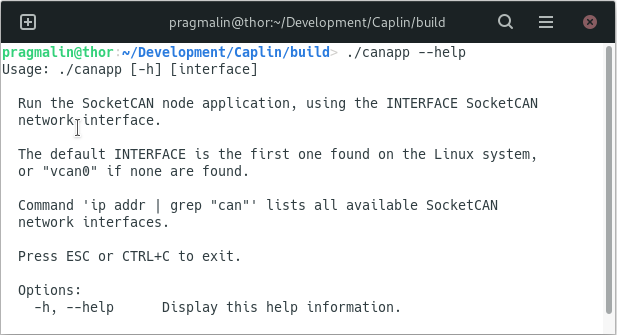
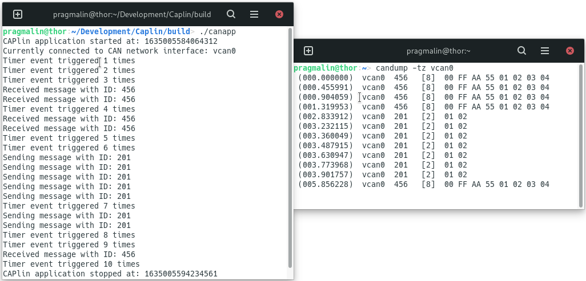

# CAPLin - CAN Application Programming for Linux
[](https://opensource.org/licenses/MIT)

CAPLin stands for **C**AN **A**pplication **P**rogramming for **Lin**ux. Think of it as an application framework for easily developing SocketCAN applications in the C programming language. It is the perfect tool for quickly programming CAN nodes for prototyping, testing, simulation and even production purposes. 

CAPLin resembles Vector CAPL scripts. Just like CAPL, it's an event driven programming environment. As an extra benefit, you code directly in C, enabling you to:

* Include and link all your favorite C libraries.
* Use development tools and IDEs that you are already familiar with.
* Debug your code without limitations.
* Reuse your code on your microcontroller based CAN node.

The only real downside, compared to a CAPL script, is that you don't have direct access to the CAN messages and signals from a CANdb DBC database file. However, you can circumvent this by using the [cantools](https://cantools.readthedocs.io/en/latest/#the-generate-c-source-subcommand) package to generate a C-source and -header file from your DBC database file, and then integrate these into your CAPLin application.

## What you need

To obtain and build CAPLin applications, make sure that your Linux system has C development and Git related packages installed:

- Debian/Ubuntu: `sudo apt install git gcc g++ gdb make cmake`
- Fedora: `sudo dnf install git gcc g++ gdb make cmake`
- openSUSE: `sudo zypper install git gcc gcc-c++ gdb make cmake`

Additionally, it is assumed that you already connected and configured a SocketCAN supported CAN interface on your Linux system. The following tutorial explains in detail how to do this:

* [Automatically bring up a SocketCAN interface on boot](https://www.pragmaticlinux.com/2021/07/automatically-bring-up-a-socketcan-interface-on-boot/)

You could even use CAPLin on a Raspberry PI in combination with a low-cost Microchip MCP2515 CAN controller based add-on board:

* [CAN communication on the Raspberry PI with SocketCAN](https://www.pragmaticlinux.com/2021/10/can-communication-on-the-raspberry-pi-with-socketcan/)

In case you do not have a SocketCAN supported CAN interface and/or a physical CAN bus to interact with, you can still experiment with CAPLin using a virtual CAN interface on Linux:

* [How to create a virtual CAN interface on Linux](https://www.pragmaticlinux.com/2021/10/how-to-create-a-virtual-can-interface-on-linux/)

## Getting the code

To get the code, clone the Git repository to a subdirectory, for example inside your own home directory:

```bash
git clone https://github.com/pragmaticlinuxblog/caplin.git ~/CAPLin
```

## Building your CAPLin application

After cloning the Git repository, you can prepare the build environment with the help of CMake:

```bash
cd ~/CAPLin/build
cmake ..
```

Note that this only has to be done once. From now on you can build the application by running this command from inside the `build` subdirectory:

```bash
make all
```

Alternatively, you can leverage the build-in functionality of an IDE such as Visual Studio Code to perform all these steps, including running and debugging your CAPLin application:

* [Import a CMake project into Visual Studio Code](https://www.pragmaticlinux.com/2021/07/import-a-cmake-project-into-visual-studio-code/)

## Running your CAPLin application

After building your CAPLin application, you can run it directly from the `build` subdirectory:

```bash
./canapp
```

Note that your CAPLin application automatically detects and connects to the first SocketCAN network interface it finds on your system. When multiple SocketCAN network interfaces are available, you can select the one to use by specifying its name as a command-line argument, e.g. `./canapp can1`. 

Once your application runs, you can press <kbd>ESC</kbd> or <kbd>CTRL</kbd>+<kbd>C</kbd> to exit. 

Refer to CAPLin's help info for additional details:



## Installing your CAPLin application

Optionally, you can install your CAPLin application system-wide, making it available to all user. The *CMakeLists.txt* contains details on how to perform this step. To install the application on your Linux system, run this command from the `build` subdirectory:

- `sudo make install`

## A demonstration CAPLin application

What does such an event driven CAPLin application look like? Here is a basic demonstration application to whet your appetite. It:

* Displays information when the application starts and stops.
* Displays the CAN identifier of all received CAN messages.
* Transmits a CAN message when the <kbd>t</kbd> key is pressed on the keyboard.
* Creates a timer that generates an event every 1000 milliseconds.

```c
#include "caplin.h"

tTimer myTimer;

void OnTimer(void)
{
  static uint32_t eventCounter = 0;

  printf("Timer event triggered %lu times\n", ++eventCounter);
  TimerRestart(myTimer);
}

void OnStart(void)
{
  printf("CAPlin application started at: %llu\n", UtilSystemTime());
  printf("Currently connected to CAN network interface: %s\n", canDevice);
  myTimer = TimerCreate(OnTimer);
  TimerStart(myTimer, 1000);
}

void OnStop(void)
{
  printf("CAPlin application stopped at: %llu\n", UtilSystemTime());
} 

void OnMessage(tCanMsg const * msg)
{
  printf("Received message with ID: %x\n", msg->id);
}

void OnKey(char key)
{
  tCanMsg txMsg = 
  {
    .id = 0x201, .ext = false, .len = 2, .data = { 1, 2 }
  };

  if (key == 't')
  {
    printf("Sending message with ID: %x\n", txMsg.id);
    CanTransmit(&txMsg);
  }
}
```

That's all you need. As you can see, thanks to the CAPLin framework, you do not have to dive deep into low-level SocketCAN, timer or thread programming. It's all built into the framework. Batteries included so to say.

The screenshot on the left shows the CAPLin demonstration application in action. The screenshot on the right shows the traffic on the CAN bus as a reference, using `candump` from the [can-utils](https://github.com/linux-can/can-utils) package:



## More CAPLin application examples

The CAPLin framework includes several example applications to help you further understand how to code with the framework. You can find these in the `examples` subdirectory. You can build and run each example, just like any other CAPLin application:

* <u>Example 1</u> - *Ping Pong*. Echoes all received CAN messages back with an incremented CAN identifier.
* <u>Example 2</u> - *On Key Transmit*. Transmits a CAN message each time a specific key is pressed.
* <u>Example 3</u> - *Periodic Transmit*. Transmits a CAN message periodically with the help of a timer.
* <u>Example 4</u> - *CAN Logger*. Logs all received CAN messages to the screen.
* <u>Example 5</u> - *Interface Override*. Programmatically sets the SocketCAN network interface to connect to.

